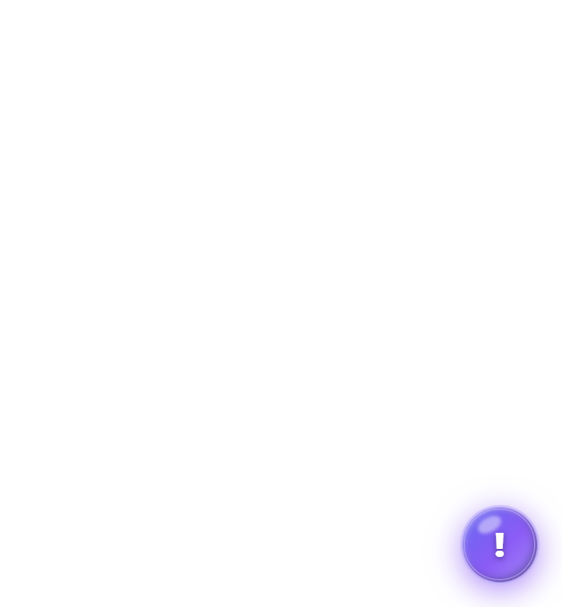
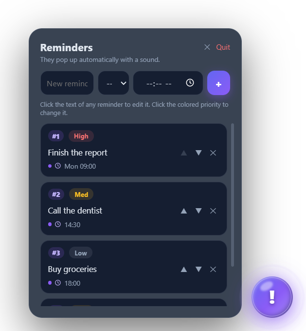
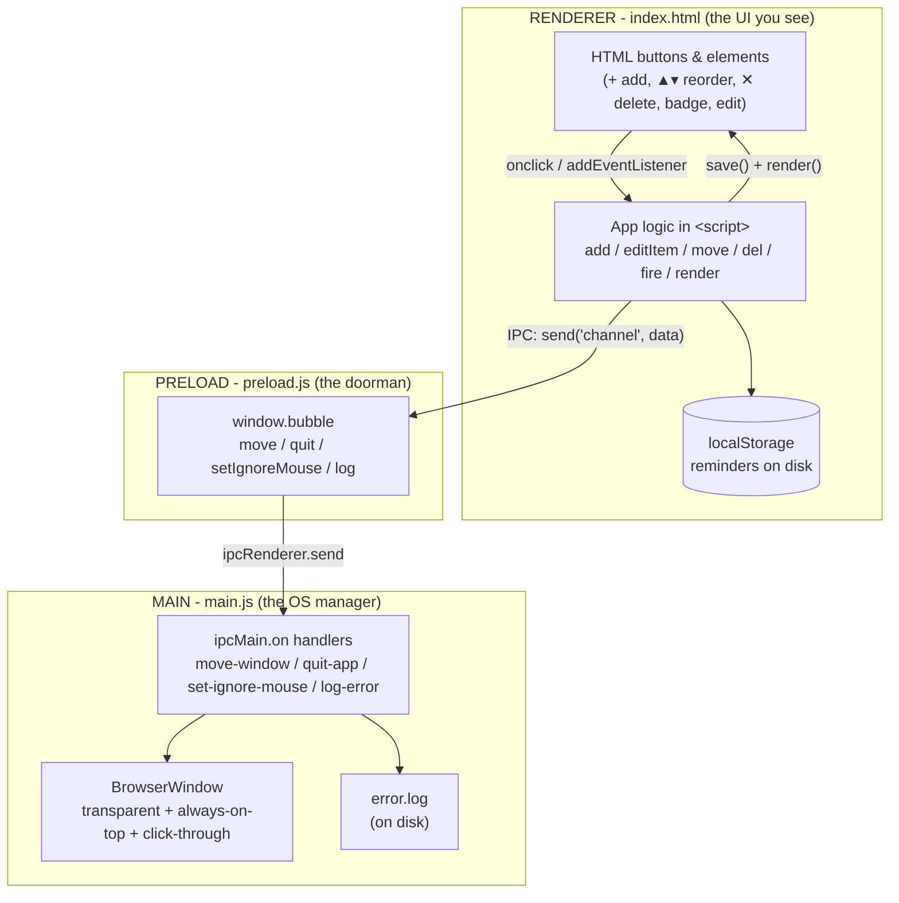
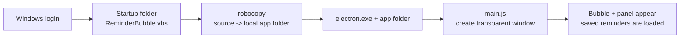
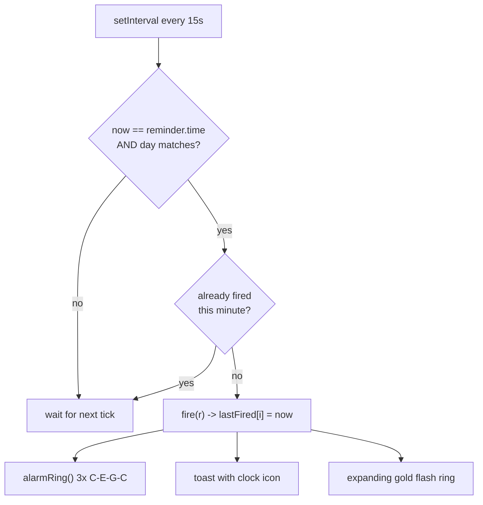

# Reminder Bubble

> A floating, "Messenger-style" glowing reminder bubble for Windows.
> It sits above all your windows, reminds you of tasks at chosen times, and never blocks your clicks.


---

## Preview

| The bubble (dormant) | Panel with reminders |
|---|---|
|  |  |

---

## Table of Contents

1. [Overview](#1-overview)
2. [Features](#2-features)
3. [Tech Stack & Tools Used](#3-tech-stack--tools-used)
4. [Components](#4-components)
5. [How The Pipeline Works](#5-how-the-pipeline-works)
   - [Architecture diagram](#51-architecture-diagram)
   - [Startup diagram](#52-startup--autostart-diagram)
   - [Reminder-firing diagram](#53-reminder-firing-diagram)
6. [Installation](#6-installation)
7. [How To Use](#7-how-to-use)
8. [Where Is Data Stored](#8-where-is-data-stored)
9. [Troubleshooting](#9-troubleshooting)

---

## 1. Overview

**Reminder Bubble** is a small always-on-top widget for Windows. A glowing purple circle
stays at the bottom-right of your screen. Click it to open a reminder panel, type what you
need to remember, pick a day and a time — and when the time arrives, it rings the alarm
and pops a toast on screen.

It is built with **Electron**: the interface is plain HTML/CSS/JS (rendered by Chromium)
while a Node.js "backend" controls the native window, its position, clicks, and startup.

### Why it exists (who it's for)
Many of us sit down to work and lose focus within minutes — drifting into other tabs,
juggling five things at once, letting ideas slip away. Writing everything in a Notion page
or a paper to-do list isn't practical either: you have to leave your screen, it breaks your
flow, and you often never check the list again.

This app is a gentle counter to that. The bubble stays quietly in the corner of your screen
as an **anchor**. Tell it what to remember, and it pops up at the exact moment you need it —
grabbing your attention, structuring your mind, and pulling you back to the one thing you
were supposed to be doing. No alt-tabbing, no page switching, no giant list to scroll.
A small habit that can pop your focus and productivity up.

---

## 2. Features

- 🟣 **Floating glowing bubble** — always on top, transparent, draggable anywhere.
- ⚡ **Click-through** — the invisible window never blocks pages or apps under it.
- ⏰ **Timed reminders** — fires at `HH:MM`, optionally only on a chosen weekday.
- 🎵 **Synthesized sound** — a ringing bell alarm at reminder time, a tiny tick on button clicks
  (no audio files — tones are generated live).
- ✅ **To-do items** — reminders without a time act as plain checkable notes.
- 🔢 **Priority & numbering** — Low/Med/High badges + automatic `#1, #2, …` labels.
- ⬆️⬇️ **Reorder** — move reminders up/down with ▲ / ▼, **or drag & drop** any reminder to move it anywhere in the list.
- ✏️ **Click-to-edit** — click any reminder's text to change it inline.
- 💾 **Persistent storage** — reminders survive restarts, shutdowns, and laptop closing.
- 🔁 **Auto-start at login** — appears by itself when you turn on the PC.

---

## 3. Tech Stack & Tools Used

| Tool | What it does in this project |
|---|---|
| **Electron 31** | Runs the app as a native Windows window while rendering HTML/CSS/JS |
| **Chromium** (bundled with Electron) | Renders the UI, plays the sound, runs the JS |
| **Node.js** (bundled with Electron) | Gives the "backend" access to the OS (window, files, process) |
| **Vanilla JavaScript** | All the app logic (no frameworks, no build step) |
| **HTML + CSS** | The bubble UI, gradients, glow, animations, frosted panel |
| **Web Audio API** | Synthesizes the ringing alarm and click sounds (oscillators + gain envelopes) |
| **localStorage** | Saves reminders on disk |
| **IPC + contextBridge** | The secure communication channel renderer ⇄ main |
| **Windows Script Host (.vbs)** | Hidden launcher that starts the app at login |
| **Batch files (.bat)** | Manual launcher + install/uninstall of auto-start |
| **robocopy** | Windows tool that syncs the WSL source → the app folder |

No frameworks, no external dependencies besides Electron itself.

---

## 4. Components

| File | Role |
|---|---|
| `app/main.js` | **Backend (main process).** Creates the transparent window, handles `move-window`, `quit-app`, `set-ignore-mouse`, `log-error` IPC, error logging, single-instance lock. |
| `app/preload.js` | **Bridge (preload).** Exposes a tiny safe API as `window.bubble` (`move`, `quit`, `setIgnoreMouse`, `log`). |
| `app/index.html` | **Frontend (renderer).** All UI (CSS) + all logic (JS): add/edit/delete/reorder reminders, priority, sounds, reminder engine, drag, click-through toggle, toast. |
| `app/package.json` | Declares the app + the `electron` dependency. |
| `start-bubble.bat` | **Windows-only launcher for the bubble UI** — does the same as `npm start`, plus one extra step if the code lives on a WSL/network path (syncs the latest files first). See "How to run start-bubble.bat" below. |
| `start_silent.vbs` | Hidden launcher used by this repo's original WSL auto-start setup. |
| `install-autostart.bat` | Enables "run at login" by putting a `ReminderBubble.vbs` file into your Windows Startup folder. Only touches your system when you run it. |
| `uninstall-autostart.bat` | Disables "run at login" (removes that Startup file). |

---

## 5. How The Pipeline Works

Three processes speak to each other over **IPC** (Inter-Process Communication).
The golden rule throughout the app:

> every user action changes the `reminders` array → saves to disk → redraws the list → plays a tick.

### 5.1 Architecture diagram



### 5.2 Startup / autostart diagram



### 5.3 Reminder-firing diagram



---

## 6. Installation (full guide for beginners)

### What you need before starting
| Tool | Why you need it | Where to get it |
|---|---|---|
| **Windows 10 or 11** (64-bit) | The app runs on Windows | — |
| **Git** | Downloads the project from GitHub | https://git-scm.com |
| **Node.js** | Includes `npm`, used once to install Electron | https://nodejs.org (LTS) |

If you're unsure whether you have Node.js, open **PowerShell** and type:
```powershell
node --version
```
If you see a version like `v20.x`, you're ready. If it says "not recognized", install it first.

### Step 1 — Clone the repository
Open a terminal (PowerShell or CMD), then:
```bash
git clone <your-repo-url> popup-reminder
cd popup-reminder
```
This downloads the whole project into a folder called `popup-reminder`.

### Step 2 — Enter the app folder and install the dependency
```bash
cd app
npm install
```
`npm install` downloads **Electron** (the engine the app runs on) into `node_modules`.
This is the only "internet download" step — it takes a minute or two the first time.

### Step 3 — Run the app
```bash
npm start
```
A **purple glowing bubble** should appear at the bottom-right of your screen, above all
your other windows. That's it — you're running it.

### Step 4 — Stop (quit) the app
Any of these closes the app completely (the bubble disappears, tasks stop):
1. Click the bubble → open the panel → press the **Quit** button.
2. Press **Esc** on your keyboard.
3. Right-click the bubble → **Quit**.

If the app ever gets stuck and won't close (rare), force-kill it from cmd/PowerShell:
```bat
taskkill /IM electron.exe /F
```

> Quitting does **not** delete your reminders — they're saved on disk (see section 8).

### Step 5 — Run the app again (no need to reinstall)
Simply run `npm start` again from the `app` folder. You never need to re-clone or
reinstall — the app stays installed on your machine.

### Step 6 — (Optional) Make it start automatically at login
If you want the bubble to appear by itself every time you log into Windows, run once:
```
install-autostart.bat
```
It puts a file called `ReminderBubble.vbs` into your Windows **Startup** folder. That's the
*only* file it creates — nothing else on your system is touched, and **nothing is added to
Startup unless you run this file yourself** (cloning, `npm install`, and `npm start` never
change any Windows settings).
- To **disable** it: run `uninstall-autostart.bat` (it deletes that one file).
- Note: auto-start only matters at login. If you quit the app mid-session it stays closed
  until you run `npm start` again (or until your next login if auto-start is enabled).

### How to run `start-bubble.bat`?
`start-bubble.bat` is a **Windows** file — WSL (Linux) can't run it. It starts the bubble
UI (the same app as `npm start`); on the original WSL setup it also syncs the latest files
to the Windows app folder first.

- Easiest: in **Windows Explorer**, double-click it.
- Or in **cmd / PowerShell**:
```bat
cd <the-folder-where-the-repo-is>
start-bubble.bat
```
(The path above is a placeholder — use the folder where you actually kept the repository.
On the original setup that's the `popup-reminder` folder under the WSL drive.)

### Why does the project use `npm`?
The repo contains only the app's source code — not the engine that runs it. To become a
desktop window, the HTML/CSS/JS needs **Electron** (a Chromium + Node engine, several
hundred MB). `npm install` reads `package.json`, downloads Electron onto your machine once,
and does nothing else. After that, `npm start` just launches Electron with the app — no
internet or additional setup needed.

### Tips
- After `npm install`, the `app` folder is **portable** — you can move it anywhere on your PC.
- The `.bat`/`.vbs` launchers in the project are an alternative way to start the app
  (they just run `npm start`-equivalent command after a file sync). Most users can ignore
  them and use `npm start` directly.

---

## 7. How To Use

### The bubble
| Action | Result |
|---|---|
| Hover over the bubble | It becomes interactive |
| Move the mouse away | Clicks pass through to the pages underneath |
| Left-click the bubble | Open / close the reminders panel |
| Drag (grab + move) | Move the bubble anywhere on screen |
| Right-click the bubble | Menu: Open reminders / Quit |
| Press `Esc` | Quit the app |
| Panel **Quit** | Quit the app |

### Add a reminder
1. Click the bubble to open the panel.
2. **Name** (optional) · **Day** (optional, `--` = every day) · **Time** `HH:MM` (optional).
3. Click **＋** or press `Enter`.

| You set... | Behaviour |
|---|---|
| Name only | Plain to-do item, no alarm ("no alarm set") |
| Time only | Fires every day at that time |
| Time + day | Fires only on that weekday at that time |
| Nothing | Nothing is added |

### Edit, priority & reorder
- **Edit** — click the reminder's *text*: an inline form opens (text, day, time, Save / Cancel).
  `Enter` = save, `Esc` = cancel.
- **Priority** — click the Low/Med/High badge to cycle it (gray / yellow / red).
- **Reorder (▲ / ▼)** — press ▲ / ▼ on an item. The `#1, #2…` numbers update automatically.
- **Reorder (drag & drop)** — grab any reminder row and drag it; a violet line shows where it will land (top or bottom half of a row), release to drop.
- **Delete** — press ✕.

---

## 8. Where Is Data Stored

| Data | Location |
|---|---|
| Reminders | `localStorage` → `%APPDATA%\popup-reminder` |
| Error log | `%APPDATA%\popup-reminder\error.log` (empty = healthy) |

Closing the laptop, restarting Windows, or quitting the app **does not erase** your reminders.

---

## 9. Troubleshooting

- **Bubble doesn't appear** → from the `app` folder run `npm start`; then check
  `%APPDATA%\popup-reminder\error.log` for errors.
- **Reminders lost** → confirm the storage folder still exists (see section 8).
- **No sound** → check volume; the alarm is a short bell ring, clicks are intentionally soft.
- **Two bubbles** → impossible by design (single-instance lock). If one seems stuck,
  run `taskkill /IM electron.exe /F`, then relaunch.

